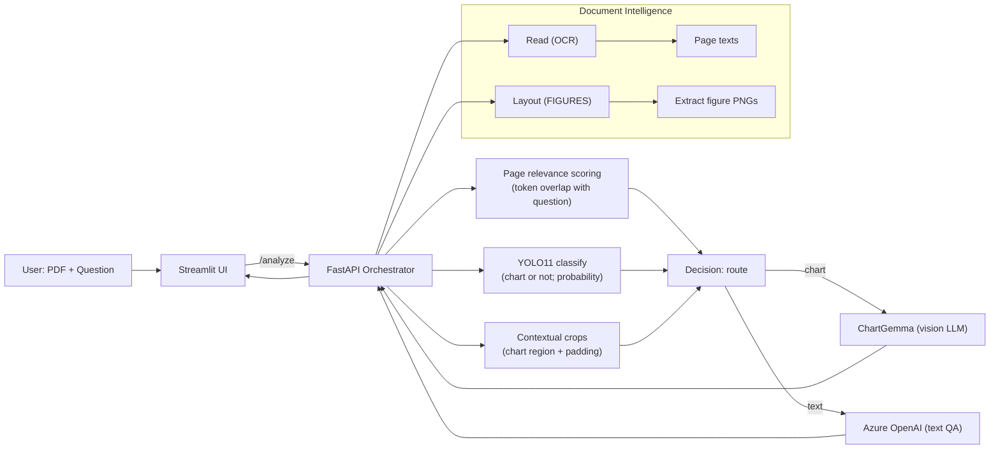

# ChartQA on Azure

This repo wires up **Document Intelligence** (OCR + figures), a **YOLO11 chart classifier** (AML), **ChartGemma** (AML), and **Azure OpenAI** (text QA) behind a tiny **FastAPI orchestrator** (deployable to AML Managed Online Endpoint via custom container) and a local **Streamlit** UI.

## Quick start

1. Copy `.env.example` → `.env` and fill your keys/URLs (DI, YOLO, ChartGemma, Azure OpenAI).
   *Minimal vars: `DI_ENDPOINT`, `DI_KEY`, `YOLO_URL`, `CHARTGEMMA_URL`, `CHARTGEMMA_KEY`, `AZURE_OPENAI_ENDPOINT`, `AZURE_OPENAI_KEY`.*

2. Start local YOLO classifier:

```bash
python -m services.yolo-local.src.server
```

3. Start the orchestrator:

```bash
uvicorn app:app --host 127.0.0.1 --port 8000 --env-file ../../.env --log-level debug
```

4. Run the UI:

```bash
streamlit run streamlit_app/app.py
```

That’s it—upload a PDF in the UI, ask a question, and the orchestrator will route to chart or text mode automatically.

---

## What this does (at a glance)

* **Uploads a PDF** → runs **OCR** and **layout/figure extraction** via Document Intelligence.
* **Finds candidate figures** → optionally creates **contextual crops** (chart + nearby labels/ticks) to improve chart QA.
* **Assesses relevance** → matches your question against per-page text to score likely pages.
* **Classifies figures** with YOLO (chart vs non-chart) and combines: page relevance, model confidence, and image size.
* **Routes the question**:

  * **Chart route** → sends the chosen chart crop to **ChartGemma**.
  * **Text route** → sends OCR text to **Azure OpenAI**.
* **Returns an answer** + lightweight **metadata** (why a figure was chosen, route, timing, etc.).
* **Streamlit UI** shows the answer, the used chart crop (if any), and debug info; keeps a **session history**.

---

## High-level flow



---

## Routing in plain words

* You can **force** the route with your prompt:

  * Start with `#chart` → always use chart mode if any figure is available.
  * Start with `#text` → always use text mode.
* Otherwise the orchestrator decides:

  1. Prefer figures YOLO said are **“chart”** with **higher page relevance** and **higher confidence**.
  2. If your question contains chart-y words (e.g., “axis, bar, line, legend, chart…”) but no YOLO chart match, pick by **page relevance**.
  3. Still nothing? Pick a **reasonable large figure** as a fallback.

> The API response includes `meta.chosen_reason` (`"yolo+page_score"`, `"page_score_only"`, `"size_fallback"`, or `"no_figure"`) so you can see why.

---

## Components (how they fit together)

* **orchestrator/app.py** — HTTP API (`/health`, `/analyze`), DI calls, page relevance scoring, candidate ranking, and final routing.
* **orchestrator/di\_utils.py** — DI client; extracts figure images, pulls page images, and builds **contextual crops** (chart with padded surroundings) using figure polygons. Falls back to PyMuPDF/pdf2image if needed.
* **orchestrator/clients.py** — thin clients for:

  * **YOLO**: multipart upload of an image crop → returns `{ label: "chart" | "other", prob: float }`.
  * **ChartGemma**: sends the
